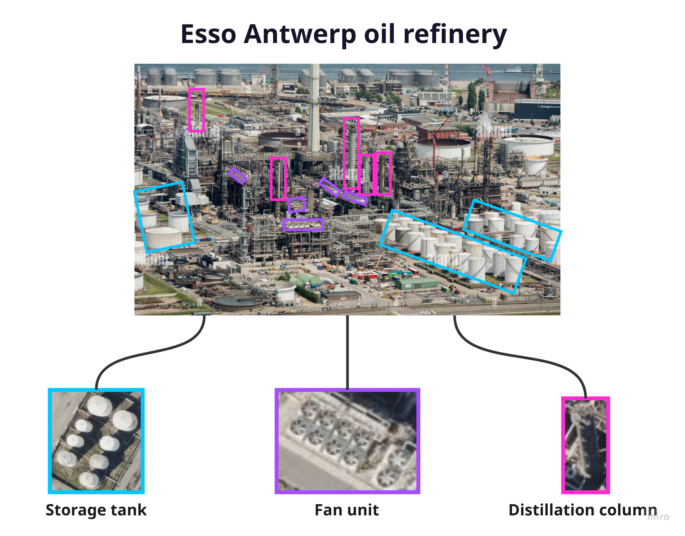
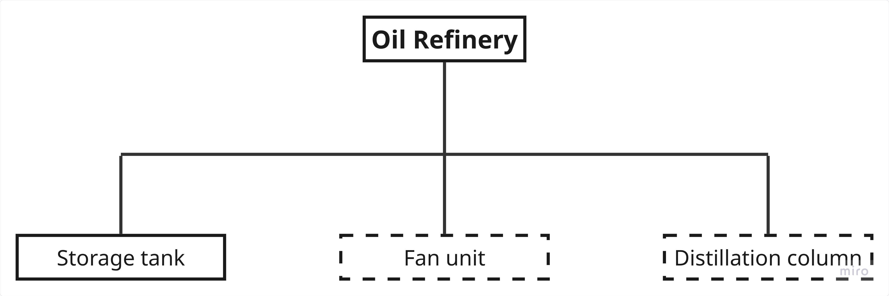

# geo-dataset-generator

Tooling for finding a kind of *site* in satellite imagery. A site is not detected as a whole.
Instead, the repo detects the objects the site is made of and checks how they sit together. It
has two parts:

1. **A semantic graph that turns detections into a site verdict.** Detectors feed the nodes, a
   site type is a rule over them, and the rule can be tuned without retraining.
2. **A fast loop for training new object classes.** It is for when a site needs objects that no
   existing model detects. The model proposes, a person judges, and a new model version is kept
   only if it scores better on a fixed benchmark.

Oil refineries are the worked example. The demo map in [`app/`](app/) applies both parts to
them. This is a proof of concept for the approach and its tooling, not a production detector.

## Why oil refineries

A refinery is made of parts that are easy to recognise from above. Storage tanks, fin-fan
cooler banks (fan units) and distillation columns appear together at almost every refinery:



That turns "is this a refinery?" into a question about which components are present, and a
graph can express that:



A public aerial model (DOTAv1) already detects storage tanks (solid box). No public model
detects fan units or distillation columns (dashed boxes), so we trained those ourselves. Part 1
covers the graph, and Part 2 covers how the missing classes were trained.

## Part 1: from detections to a site verdict

A detector outputs something like "tank, 0.9, here". It never says "refinery", and tanks are
also found at ports, tank farms and power stations. The semantic graph
([`app/server/semantic_graph.json`](app/server/semantic_graph.json)) stores the refinery rule as
data:

```json
"oil_refinery": { "kind": "site", "min_types_present": 3, "default_max_distance_m": 300 },
"edges": [
  { "relation": "requires", "from": "oil_refinery", "to": "storage tank",        "min_confidence": 0.75 },
  { "relation": "requires", "from": "oil_refinery", "to": "fan-unit",            "min_confidence": 0.7 },
  { "relation": "requires", "from": "oil_refinery", "to": "distillation-column", "min_confidence": 0.65, "min_count": 3 }
]
```

- **Components** are nodes. Any detector can feed one, whether pretrained or custom-trained.
- **A site** is a rule over its components: which ones must be present, their minimum
  confidence, how many are needed and how close together they must be. Fan units count only in
  groups (`group_within_m: 20`), because one fan on its own is not evidence.
- **The site outline** is not drawn by hand. It is the area where the components cluster.
- **Tuning is offline.** Detections are cached per tile once. The whole benchmark can then be
  re-scored under new thresholds in seconds, with no retraining.

**Result.** With the same detectors, the first rule called almost every industrial site a
refinery. Changing only the graph, plus one round of look-alike negatives, brought that to
**16 of 18 refineries found and 0 of 39 look-alikes flagged** (power stations, ports, tank
farms, steelworks and chemical plants) on a 57-site benchmark. Design history:
[docs/semantic-graph.md](docs/semantic-graph.md). Threshold decisions:
[app/server/context/server.md](app/server/context/server.md).

## Part 2: training the missing classes

Labelling a new class by hand from scratch is slow. In this loop the model does most of the
labelling and a person reviews its work, which takes about ten minutes per round:

```
seed ~20-40 hand-drawn samples -> train v1
  └─ each round, one unseen refinery site:
       scan      model proposes boxes over the whole site (low threshold, on purpose)
       sweep     reviewer draws what the model missed        -> measures coverage
       triage    reviewer marks each proposal yes / no       -> yes = sample, no = hard negative
       apply     judgements become training data
       train     a candidate model on the grown dataset
       gate      candidate replaces the incumbent only if it wins on the benchmark
```

The **gate** keeps the loop honest. A new version replaces the current one only if it scores
better on two recorded measures: coverage on a site it has never seen, and whether its
confident detections land on refineries rather than look-alikes. Hard negatives are added in
proportion to positives, because too many of them collapsed a small model
([loop.md](scripts/loop/context/loop.md)).

**Result.** `distillation-column` started from 22 hand-drawn samples and reached 476 after 21
rounds. Most of the new samples were model proposals that a reviewer accepted. In round 6, on a
site the model had never seen (Scholven), it found 29 of the 32 columns, with 79 % precision at
confidence ≥ 0.5. `fan-unit` was built the same way and has 382 samples.

**Samples as a STAC catalog.** Every sample and hard negative is also exported as
[stac-geoparquet](https://github.com/stac-utils/stac-geoparquet) to
`classes/<class>/stac/`, by [`scripts/stac_export.py`](scripts/stac_export.py). Each record is a
STAC item holding the outline, the class label and a georeferenced image crop. The catalog is
rebuilt every time a package is generated, so it always matches the training data. DuckDB or
GeoPandas can query it directly, for example "all labelled columns in this area". The images
come from Mapbox, so remove them before sharing the catalog outside the team.

Full process: [docs/training-a-new-class.md](docs/training-a-new-class.md). Round-by-round log:
[scripts/loop/context/loop.md](scripts/loop/context/loop.md).

## The demo app

Live at **<https://refinery.stamsite.cc/>**. The first load can take a few minutes.

- **Site panel** (top left) lists seven refineries and seven look-alikes. Picking a site fits
  the map to it and runs every zoom-17 tile through all three detectors live on the GPU. A
  large refinery takes about 15 s, and nothing is precomputed.
- **Boxes on the map** are detections from the custom and pretrained classes. A dashed box
  passed its confidence floor but does not count toward the rule (for example, a lone fan).
- **Graph widget** (bottom) shows each component node turning yellow when it fires and green
  when its requirement is met. The *oil refinery* node turns green only when the whole rule
  holds.
- **Verdict**: each site turns green ("oil refinery") or red ("not a refinery"). Look-alikes
  light up some components but never the refinery node, and that difference is the point of
  the demo.

A guided tour starts after the first site. You can also pan freely: at zoom ≥ 16, whatever is
in view gets classified live.

## Next: near-real-time monitoring

A site goes from raw tiles to a verdict in about 15 s. The pipeline could therefore check new
imagery of watched sites as soon as it arrives, and flag changes such as a unit appearing, tanks
being added, or a site starting or stopping to match its rule.

In that setup, the delay would come from how often new imagery is captured, not from processing
time. The demo's Mapbox basemap is undated and rarely refreshed. A live setup would need a
high-resolution source with frequent revisits and known capture times. The detectors, the graph
and the training loop would stay the same.
