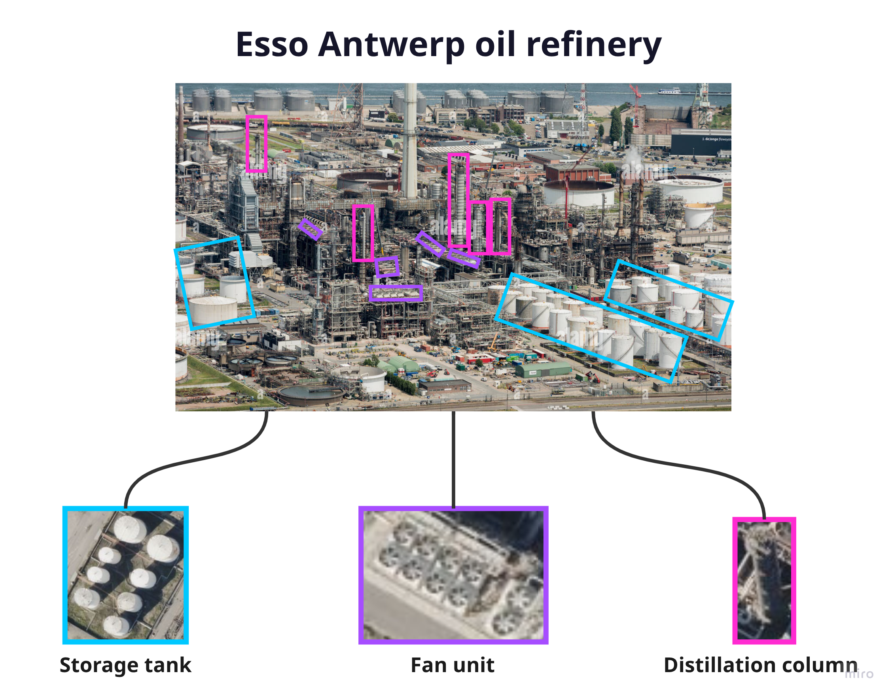
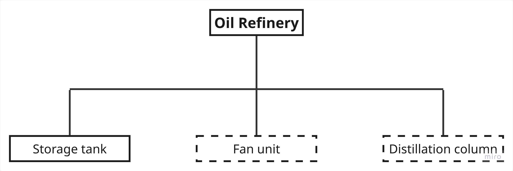
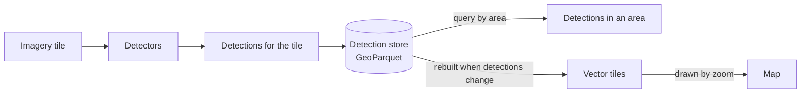
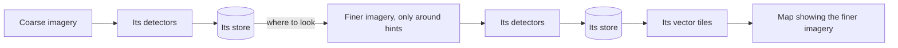

# geo-dataset-generator

Tooling for finding a type of scene in satellite imagery. A scene is not detected as a whole.
Instead, the repo detects the objects the scene is made of and checks how they sit together. It
has two parts:

1. **A semantic graph that turns detections into a scene verdict.** Detectors feed the nodes, a
   scene type is a rule over them, and the rule can be tuned without retraining.
2. **A fast loop for training new object classes.** It is for when a site needs objects that no
   existing model detects. The model proposes, a person judges, and a new model version is kept
   only if it does better on the sites seen so far.

## Oil refineries use case

A refinery is made of parts that are easy to recognise from above. Storage tanks, fin-fan
cooler banks (fan units) and distillation columns appear together at almost every refinery:



That turns "is this a refinery?" into a question about which components are present, and a
graph can express that:



A public aerial model already detects storage tanks (solid box). No public model
detects fan units or distillation columns (dashed boxes), so we trained those ourselves. Part 1
covers the graph, and Part 2 covers how the missing classes were trained.

## Part 1: from detections to a scene verdict

A detector outputs something like "tank, 0.9, here". It never says "refinery", and tanks are
also found at ports, tank farms and power stations. The semantic graph
([`app/server/semantic_graph.json`](app/server/semantic_graph.json)) stores the refinery rule as
data:

```json
"oil_refinery": { "kind": "scene", "min_types_present": 3, "default_max_distance_m": 300 },
"edges": [
  { "relation": "requires", "from": "oil_refinery", "to": "storage tank",        "min_confidence": 0.75 },
  { "relation": "requires", "from": "oil_refinery", "to": "fan-unit",            "min_confidence": 0.7 },
  { "relation": "requires", "from": "oil_refinery", "to": "distillation-column", "min_confidence": 0.65, "min_count": 3 }
]
```

- **Components** are nodes. Any detector can feed one, whether pretrained or custom-trained.
- **A scene** is a rule over its components: which ones must be present, their minimum
  confidence, how many are needed and how close together they must be. Fan units count only in
  groups (`group_within_m: 20`), because one fan on its own is not evidence.
- **The scene outline** is not drawn by hand. It is the area where the components cluster.
- **Tuning is offline.** Detections are cached per tile once. The whole benchmark can then be
  re-scored under new thresholds in seconds, with no retraining.

## Part 2: training the missing classes

Instead of labelling a large dataset up front, each class is grown site by site on real
locations, in short iterations:

1. **Find sites** from open-data indicators such as OpenStreetMap tags: refineries to learn
   from, and look-alikes (ports, power stations, factories) to test against.
2. **Scan** a new site with the current model, starting from a small hand-drawn seed.
3. **Give feedback** by marking positive samples (hits and misses) and negative samples
   (mistakes).
4. **Retrain**, and keep the new model only if it does better on the sites seen so far.

All samples are also exported as a STAC catalog (GeoParquet) to `classes/<class>/stac/`, so
standard geospatial tools can query them. Remove the image crops before sharing it outside the
team, since the imagery is licensed.

Full process: [docs/training-a-new-class.md](docs/training-a-new-class.md).

## Part 3: storing detections and reusing them

Running the detectors is the expensive step, so the results are kept instead of thrown away. Two
needs are kept apart, each with its own format:

- **Querying** uses a GeoParquet store. Detections are saved per tile with their class,
  confidence and location, so they can be looked up by area without running the detectors again.
- **Display** uses vector tiles built from that store. The map draws them at every zoom level and
  never touches the store directly.


```mermaid
flowchart LR
    I[Imagery tile] --> D[Detectors]
    D --> F[Detections for the tile]
    F --> S[(Detection store<br/>GeoParquet)]
    S -->|query by area| Q[Detections in an area]
    S -->|rebuilt when detections change| T[Vector tiles]
    T -->|drawn by zoom| M[Map]
```

When a tile is processed again, its stored detections are replaced, and the vector tiles are
rebuilt from the store, so the map always shows the latest run.

The same store is how several imagery sources work together. Sources run in one fixed order,
cheapest and widest coverage first. Each later source asks the store what the source before it
found, and only looks closely around those places. Each source keeps its own detectors, scene
rules, store and vector tiles, and the map shows the tiles that match the imagery on screen:


```mermaid
flowchart LR
    C[Coarse imagery] --> CD[Its detectors] --> CS[(Its store)]
    CS -->|where to look| F[Finer imagery, only around hints]
    F --> FD[Its detectors] --> FS[(Its store)]
    FS --> FT[Its vector tiles] --> M[Map showing the finer imagery]
```

If the coarse source finds nothing the finer one is meant to refine, the chain stops there.

This path is optional and switched off by default.

## The demo app

Live at **<https://refinery.stamsite.cc/>**. The first load can take a few minutes. Pick a
refinery or a look-alike site and all three detectors and the graph run on it live, within
seconds. A guided tour explains the interface after the first site.

## Next: complex scenes from fused sources

Some scenes cannot be identified from a single source. Fusing several sources lets us find them.

Each source shows something different. A wide and cheap source shows where something might be. A
sharper source, or another kind of sensor, shows what it is. So each source gets its own graph,
built around what that source can resolve at its resolution and refresh rate. The graphs are then
chained into levels, in the source order from Part 3.

The first level is the cheapest and coarsest. It runs over the whole area of interest. Each next
level covers less ground and only looks where the level before found something. That is where it
can afford better imagery and heavier computation. The expensive steps run only where they are
needed.

Each level does two jobs. It focuses the search on places likely to hold more detections. It also
checks what earlier levels found, so false positives are removed rather than passed on. The area
keeps shrinking, and the last levels may look only at the detections themselves.

A graph has its own classes. It names only what its own detectors can see in its own imagery, and
does not inherit the classes of the graph before it. Levels are linked by hints instead. A later
graph points to a class from the previous source and looks only around those places, within a set
distance.

Each class also declares why it is looked for on that source. This purpose decides how its
detections are processed. A detection may only narrow where the next source looks. It may also
confirm or reject what an earlier source found, using a signal only this source measures.

Any scene that can be described by its visible components works the same way, on any source that
can resolve them.
