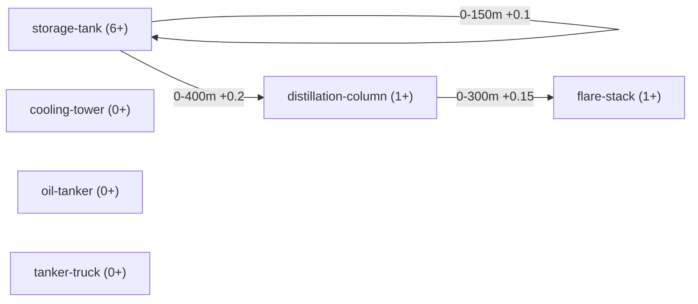

# From detections to meaning: a semantic graph

Status: roadmap/design draft, nothing here is implemented yet. The first concrete slice to build
is scoped in "First slice: fuse the two pretrained checkpoints, no fixed component list" below.

## The problem with a flat cluster

`README.md`'s existing "Composition rule" draft is a single flat step: cluster nearby detections
by proximity (DBSCAN `eps`), then match the cluster's component counts against one profile table
to decide "is this a refinery." That's the special case of a more general shape this doc is about:

- A component doesn't necessarily belong to exactly one higher-level thing. The same storage tank
  could be evidence for "this is part of an oil refinery" *or* "this is part of a separate tank
  farm/fuel depot" depending on what else is nearby — ownership isn't exclusive, so a tree
  ("parent/child") is the wrong shape. A graph is: a component has proximity *edges* to whatever's
  near it, and which higher-level grouping(s) it ends up counted toward falls out of scoring those
  edges against different site profiles, not a single fixed assignment.
- A site's boundary isn't drawn or configured — it emerges from where the proximity chain breaks.
  Worked example (the one raised in conversation): a storage tank near a chimney near a
  distillation column, all within the proximity threshold of each other, raises the probability
  this is an oil refinery. The site's extent is exactly the connected region reachable by chaining
  "next component within threshold" outward from any seed component in it — it stops, naturally,
  at the point where no further oil-refinery-relevant component is found within reach. This is
  ordinary density-reachable clustering (what DBSCAN already does); the site boundary is a
  byproduct of the algorithm, not a separate step.
- The same node-and-edge idea can stack. A site could itself become a node at a higher level (e.g.
  several sites close together reading as one industrial/port complex) — not designed yet, flagged
  so the base layer doesn't accidentally get built in a way that can't stack.

## Proposed terminology

"Semantic parent/group" was the placeholder name in conversation; better names, since "parent"
implies exclusive tree ownership this explicitly isn't:

| Term | Meaning |
|---|---|
| **Component** | A base-level detection (storage tank, chimney, distillation column, ...) — a node. |
| **Edge** | A proximity relationship between two components, with a distance threshold — exactly the primitive `geometry.py` already computes (see below). |
| **Site** | An emergent cluster of components connected (directly or transitively) within threshold — what the worked example above converges on. Not exclusive: a component can sit inside more than one candidate site if it's near enough to more than one plausible cluster. |
| **Site profile** | The composition rule for one site *type* (generalizes `README.md`'s existing per-class count-range table): which component types, in what count ranges, define "this site reads as an oil refinery" vs. some other type. |

## What already exists in this repo that's relevant

- **`geometry.py`** (`oil_refinery/app/server/`) already computes global-pixel-space distance
  between two detection centroids, plus a `meters_per_pixel` scale factor — the exact edge-weight
  primitive this needs. Not currently wired into anything; this is what the classifier's proximity-
  edge evaluation would consume (see "Pipeline" below) -- not the fuser, which resolves duplicates by
  spatial overlap (IoU) instead of centroid distance.
- **`scripts/subclass_graph.py`** already does a *related but narrower* thing: proximity-based
  confidence boosting between a single class's own sub-classes (e.g. `fence-face` boosting a
  nearby `fence-top` detection's confidence), as directed edges with a min/max distance and a
  boost value, stored per-class in `classes/<parent>/subclass_graph.json`. Different purpose
  (adjusting confidence during labeling, not identifying a site) and different scope (siblings of
  one class, not cross-class site composition) — but the same core shape (typed nodes +
  distance-threshold edges). Worth knowing before building this so the two don't end up as two
  incompatible graph formats solving adjacent problems.
- **`README.md`'s Composition rule draft** is the single-level special case of a site graph:
  cluster once, match one profile. This doc generalizes it (multiple candidate sites per
  component, multiple levels) rather than replacing it — the flat version is still probably the
  right first implementation.

## Prerequisite: dedup

Before components can be clustered into sites at all, detections from multiple fused models need to
be collapsed where they describe the same real-world object -- this is the fuser's job. See
"Pipeline: model router, fuser, classifier" below for the actual mechanism (spatial overlap plus a
fuzzy label match); the centroid-distance primitive `geometry.py` provides is reserved for the
classifier's proximity edges instead, not this step.

## Two refinements settled in conversation

- **Bridging mitigation**: two distinct real facilities getting merged into one cluster by a
  single close component pair (a real risk in dense areas like ports/refinery complexes) is
  guarded against by requiring **type coverage, not just presence**: a site profile match needs a
  minimum number of the profile's *distinct* component types to be present (each within its own
  count range), not just a handful of components total. A bridged blob spanning two unrelated
  facilities is unlikely to coincidentally satisfy full type coverage for either profile, so a weak
  match (e.g. 2 of 6 expected types) should be treated as no identification rather than a
  low-confidence one. Doesn't eliminate the risk, but narrows it considerably — still worth testing
  against real adjacent-facility cases once there's real data.
  **Same-type adjacency (two real refineries merging into one detected site) is explicitly not
  treated as a separate problem** -- if it happens, that's the proximity threshold being too loose
  for that case, i.e. a calibration issue (see the placeholder-numbers caveat below), not a gap in
  the aggregation logic itself.
- **Per-component-class proximity, not one global threshold**: different component types within
  the same site profile can legitimately have different density characteristics (e.g. storage
  tanks tightly packed, a flare stack or crane much sparser but still genuinely part of the site).
  A single `eps` for the whole site profile can't represent that. `scripts/subclass_graph.py`
  already solves exactly this shape of problem for a different purpose — its edges are
  `{from, to, min_distance_m, max_distance_m, boost}`, i.e. per-*pair*-of-types distance ranges,
  not one graph-wide constant. A site profile's proximity rules should very likely reuse that same
  edge shape (component-type pairs -> distance range) rather than inventing a new schema.

## Proposed schema: a site profile is one graph

Consolidating the above: counts, per-pair proximity, and the identification threshold shouldn't be
three separate config surfaces (a table plus ad-hoc rules) — they're all properties of one graph,
in the same shape `subclass_graph.json` already uses, just one level up (component types instead
of sub-classes of one class) and with one new graph-level field:

```json
{
  "site_type": "oil_refinery",
  "identification_threshold": { "min_types_present": 4, "of_total_types": 6 },
  "nodes": {
    "storage-tank":         { "min_count": 6, "max_count": null, "min_confidence": 0.3 },
    "flare-stack":          { "min_count": 1, "max_count": null, "min_confidence": 0.3 },
    "distillation-column":  { "min_count": 1, "max_count": null, "min_confidence": 0.3 },
    "cooling-tower":        { "min_count": 0, "max_count": null, "min_confidence": 0.3 },
    "oil-tanker":           { "min_count": 0, "max_count": null, "min_confidence": 0.3 },
    "tanker-truck":         { "min_count": 0, "max_count": null, "min_confidence": 0.3 }
  },
  "edges": [
    { "from": "storage-tank", "to": "storage-tank", "min_distance_m": 0, "max_distance_m": 150, "boost": 0.1 },
    { "from": "storage-tank", "to": "distillation-column", "min_distance_m": 0, "max_distance_m": 400, "boost": 0.2 },
    { "from": "distillation-column", "to": "flare-stack", "min_distance_m": 0, "max_distance_m": 300, "boost": 0.15 }
  ]
}
```

Same graph, illustrated the way `/manual`'s graph tab already renders `subclass_graph.json` today
(Mermaid, nodes as boxes, edges labeled with their distance range + boost):



`cooling-tower`, `oil-tanker`, and `tanker-truck` sit in the graph as valid profile members with no
edge yet in this sketch -- corroborating, per `README.md`'s original table, not proximity-defining.
The `storage-tank -> storage-tank` edge is a same-type self-loop: tanks clustering near *other*
tanks is itself a real proximity signal for this profile, not just tanks near a distillation column.

- `nodes`: one entry per component type this profile cares about, with its expected count range
  (`README.md`'s existing per-class table, just moved into the graph instead of sitting beside it)
  plus a `min_confidence` floor -- a detection below it doesn't count toward that type's count at
  all, as far as this profile is concerned. Per-node rather than one global constant, matching the
  same reasoning `subclass_graph.json`'s per-node overrides already use: different component types
  can warrant different confidence bars (a large, distinctive `storage-tank` detection is trustworthy
  at a lower confidence than a `crane`, which is smaller and easier to confuse with clutter). This is
  a different thing from the routing-level `CONF_THRESHOLD` in `server.py` (see "Open questions"
  below) -- that one decides whether a detection exists at all; `min_confidence` decides whether an
  existing detection is trusted enough to count toward *this profile's* composition check. A
  detection can fail a stricter node-level floor while still existing at the router's looser one.
- `edges`: per-type-pair proximity (`min/max_distance_m`) and a confidence weight (`boost`) --
  identical shape to `subclass_graph.json`'s edges today, same field names on purpose.
- `identification_threshold`: the graph-level type-coverage rule from the bridging mitigation above
  -- e.g. "at least 4 of these 6 node types must be present, each within its own count range" for
  this graph to signal "oil refinery" at all.

Sketch only -- every number above is a placeholder, same caveat `README.md` already carries for its
own table. The point of this section is the *shape* (one graph, not three separate config surfaces),
not these specific values. It's also the target end-state node list -- see "First slice: fuse the
two pretrained checkpoints, no fixed component list" below for what actually drives the first
profile's node set.

Because it's the same shape as `subclass_graph.json`, the existing `/manual` graph tab's Mermaid
rendering (nodes as boxes, edges labeled with their distance range) should extend to this with
comparatively little new code -- the "easier for a human to understand the relation" benefit isn't
speculative, it's already-built tooling this would inherit.

## Resolved: candidacy vs. affiliation

"A component isn't exclusively owned by one site" (stated early in this doc) describes the raw
graph, not the final output -- those are two different things, worth keeping distinct:

- **Candidacy** (the graph): non-exclusive by construction. A component can have proximity edges
  reaching more than one plausible cluster, so it's *evaluated* against more than one site profile.
- **Affiliation** (the aggregator's output): exclusive. The aggregator resolves candidacy by
  ranking candidate sites by prominence (how strongly each satisfies its profile), lets the most
  prominent one claim its region and every component in it first, then removes those claimed
  components before evaluating the next candidate. A component already affiliated with site X
  cannot also be claimed by a nearby site Y, even if it was geometrically a candidate for both.

So membership is non-exclusive going in (candidacy), exclusive coming out (affiliation) -- a greedy
claim-by-prominence resolution, not weighted/fuzzy multi-membership.

## Resolved: component-to-profile index

Confirmed: no new field on the component itself -- the site profile's own `nodes` array/dict (already
in "Proposed schema" above) stays the single source of truth, and the reverse lookup below is built
from it, not authored separately.

Candidacy (above) says a component type can be relevant to more than one site profile. The
classifier's own efficiency goal (see "Pipeline" below) needs a fast way to answer "which profile(s)
is *this* component type even plausibly relevant to" without scanning every `site_profiles/*.json`
file for every detected component. Concretely, this needs a reverse index: component type ->
array of site profiles that list it as a node. In conversation this got called each component's
"potential parents" -- not adopting that as an official term here, since "Proposed terminology"
above already retired "parent" for the same reason (it implies exclusive tree ownership, which
candidacy explicitly isn't) -- but it's the same idea as "site profile," already a named term.

- **This index is derived, not hand-authored.** A component type's array of candidate site profiles
  doesn't need its own field on the component -- it's just every `site_profiles/*.json` file whose
  `nodes` dict happens to mention that type, inverted. Same principle `scripts/subclass_graph.py`
  already applies elsewhere (`node_names()` derives valid names from `common.list_classes()` rather
  than a hand-maintained list): one source of truth (the site profile files themselves), with the
  reverse lookup built from it, not maintained as a second copy that can drift out of sync.
- **Proximity and thresholds still live entirely on the site profile, never on the component.**
  This was already true of the schema above (`edges`, `min_count`/`max_count`/`min_confidence` are
  all fields inside a profile's `nodes`/`edges`, not the component type itself) -- worth restating
  because it's exactly the reasoning behind it: the same pair of component types can need a
  different proximity range depending on which profile is doing the evaluating (storage tanks might
  legitimately sit closer together in one site type than another), so a component can't own a single
  proximity value that would have to be right for every profile it's a candidate for. The index above
  only answers "which profiles should even look at this component" -- it doesn't carry any of the
  profile-specific numbers itself.
- **"Min number of children to identify the parent" is `identification_threshold`, already
  specified** -- flagging this mapping explicitly in case the intent was something else: "if we have
  6 children we can define that 3 is enough, or a stronger validation and it could be 5" reads as
  exactly `{"min_types_present": 3, "of_total_types": 6}` vs. `{"min_types_present": 5,
  "of_total_types": 6}` from "Proposed schema" above -- tuning how many of a profile's distinct node
  *types* must be present, not a new parameter. No schema change needed here unless this was meant
  to describe something else (e.g. a per-type leniency separate from `min_count`).

## Resolved: prominence scoring

Two-tier, evaluated in order -- not one blended number:

1. **Type-coverage ratio** (primary key): distinct node types present within their count range,
   divided by total node types in the profile -- the same ratio `identification_threshold` already
   uses. Decides ranking whenever candidates differ on it.
2. **Instance strength** (tie-break only, when two candidates have equal type-coverage ratio):
   total component *instances*, not just which types were found -- a site with 12 storage tanks is
   a stronger candidate than one with 6, even though both clear the "storage-tank present" bar.
   Raw instance counts aren't comparable across different site profiles, though -- a profile with
   larger expected counts would win on raw numbers regardless of fit. Normalize each matched type's
   instance count against *that type's own* `min_count` before summing: `sum(actual_count /
   min_count)` across matched types. A profile matched at exactly its minimums scores 1 per type
   either way; a profile matched several multiples over its minimums scores higher -- comparable
   across profiles with different expected magnitudes, per the point about each parent having
   different components.

Type-coverage decides first; instance strength only breaks a tie, matching "if both have the same
score, multiply by the number of instances" from conversation directly.

## Open questions (still unresolved)

- Whether two-tier (coverage, then instance-strength tie-break) is the right shape once tested
  against real data, vs. some blended weighting -- untested, just specified.
- What happens on a genuine tie even after the instance-strength tie-break (both ratio and
  normalized instance strength equal) -- not specified; likely rare enough to defer.
- Whether a level above "site" (e.g. multi-site industrial complex) is actually needed for this
  project, or a speculative extension not worth building until a real case calls for it.
- All distance thresholds, count ranges, and type-coverage minimums remain placeholders per
  `README.md` — need calibration against real, known refineries before any of this is trustworthy,
  not just structurally sound. **This is an accepted, deliberate risk of the chosen approach, not
  a gap to patch by pulling in outside data sources** -- the point of this phase is to see what's
  achievable with exactly the models actually available (DOTAv1 + DIOR for the first slice below,
  more as custom-trained checkpoints are added), not to fuse in additional external data to
  compensate. Calibration still means testing against known real refineries as ground truth (as
  already planned) -- that's validating the available models' own output against reality, not
  adding a third data source.
- **Router-level confidence floor, now that routing is unfiltered**: `CONF_THRESHOLD = 0.15`
  (`server.py`) was tuned for one class requested at a time; with the router triggering every class a
  model knows about, that same low threshold now applies across ~15-20 classes per model at once,
  raising false-positive volume feeding the fuser/classifier. This is upstream of the graph's own
  per-node `min_confidence` (see "Proposed schema" above, which settles *that* one) -- the router
  floor decides whether a detection exists at all before either the fuser or classifier ever sees it,
  so a too-low value here still means noise floods in ahead of anything the graph's parameters can
  filter. Still needs a real value, same calibration-against-real-refineries caveat as everything
  else in this list.

## First slice: fuse the two pretrained checkpoints, no fixed component list

What changed from the original plan is narrower than it might sound: **no custom-trained model for
this phase**, not "only look for two specific components." The first slice runs the two pretrained
checkpoints already in this repo (DOTAv1's `models/yolo11n-obb.pt`, DIOR's
`models/DIOR_yolov8s_backbone.pt`), each triggered **unfiltered** — every class either model knows
about, not a config-picked subset (see "Pipeline" below: `config.json`'s current per-target
`class_id` filter, which restricts a model to one class before it even runs, goes away; nothing
tells a model in advance what to look for) — and feeds whatever comes out into the site-profile
graph logic already specified above (nodes/edges/`identification_threshold`/candidacy/affiliation/
prominence). That logic layer is already generic by design (see "The problem with a flat cluster"
and "Proposed schema" above): it doesn't hardcode which component types must show up, it scores
whatever's present against a profile's `nodes`. Nothing about this slice changes that — it's the
first time it runs against real fused detections instead of a sketch.

- **`distillation-column` drops out because neither pretrained checkpoint has that class**, not
  because this slice is scoped down to specific components on purpose. It has labeled samples
  (`classes/distillation-column/`) but no trained model, so it simply isn't part of what these two
  checkpoints can produce yet. It re-enters the profile once a `distillation-column_obb_v*.pt`
  exists — no other change needed, since the profile's `nodes` already generalize to whatever
  classes are available.
- **The two checkpoints' full class lists overlap heavily on the refinery-relevant subset**, checked
  directly against each model's own `model.names`:
  | Concept | DOTAv1 (`yolo11n-obb.pt`) | DIOR (`DIOR_yolov8s_backbone.pt`) |
  |---|---|---|
  | storage tank | `storage tank` (id 2) | `storagetank` (id 15) |
  | ship / oil tanker | `ship` (id 1) | `ship` (id 12) |
  | harbor / marine terminal | `harbor` (id 7) | `harbor` (id 11) |
  | vehicle / tanker truck proxy | `large vehicle` (id 9), `small vehicle` (id 10) | `vehicle` (id 18) |
  | chimney | -- | `chimney` (id 5) |

  (Each model also returns plenty of classes with no refinery relevance at all -- `plane`, `bridge`,
  `tennis court`, `windmill`, etc. -- since nothing filters them out anymore; the classifier stage
  below is what's responsible for ignoring those, not the router.) Only `chimney` is unique to one
  checkpoint among the relevant ones. This is why **dedup/fusion is an immediate, active
  prerequisite for this slice**, not a deferred one -- see the fuser stage below, which handles it
  by combining spatial overlap with a fuzzy label match, rather than requiring exact-matching
  class-name strings (two boxes can be the same real-world object even when the two models don't
  use identical class vocabularies).
- The site profile's `nodes`/`edges` for this slice cover whatever canonical types the fuser (see
  below) resolves overlapping detections down to -- not fixed to a specific list in this doc. The
  full 6-node sketch earlier is still the target end-state as more classes (custom or pretrained)
  become available.

## Pipeline: model router, fuser, classifier

Three separate stages, each its own module, each a different kind of logic -- this is the concrete
shape the first slice above gets implemented as:

1. **Model router** (`model_router.py`) -- decides *which models* run against an incoming tile.
   Generalizes `server.py`'s current per-tile loop over `TARGETS`, but drops that loop's other job:
   today each target also carries a `class_id` that restricts its model to one class before
   inference runs at all (`classes=[class_id]` passed straight to `model.predict`). That goes away
   -- a triggered model always returns everything it detects, every class it knows about. The
   router's only decision is which configured models are worth running for this tile at all (zoom
   gating already exists via `MIN_DETECT_ZOOM`; room for other tile-level routing criteria later),
   never which classes within a model to look for.
2. **Fuser** (`fuser.py`) -- takes the raw per-model detections for one tile and fuses them into one
   list. Every detection it's given is tagged with the tile identifier it came from (`server.py`
   already computes `tile_id = f"{z}_{x}_{y}"`); the fuser's first job is to confirm every detection
   in a batch shares that same tile_id and refuse to mix detections from different tiles. Not
   expected to actually catch anything today -- the queue processes one tile at a time serially --
   but it's a correctness guard against a future concurrent worker silently cross-contaminating
   tiles, not dead code. Once confirmed same-tile, it lays every model's detections over one another
   in shared pixel space and checks spatial overlap (IoU on the oriented boxes) for every cross-model
   pair. Two overlapping detections are only collapsed into one when their labels also read as the
   same underlying concept -- overlap alone isn't evidence of duplication, since a class describing a
   large area (`harbor`) will legitimately contain many distinct smaller objects (a `ship` sitting
   inside a `harbor` box stays two separate components). "Same underlying concept" is resolved with a
   substring check, not an explicit mapping table: normalize both labels (lowercase, strip
   whitespace/hyphens) and treat them as one type if either is a substring of the other -- this is
   what collapses `storage tank` (DOTAv1) and `storagetank` (DIOR) into one canonical type without a
   maintained lookup file, and what keeps DOTAv1's `large vehicle`/`small vehicle` recognizable as
   the same family as DIOR's `vehicle` -- cheap and approximate, revisit if it starts merging or
   splitting types it shouldn't. **DOTAv1 is the fixed convention, not a per-pair configurable
   choice**: on a confidence tie DOTAv1 wins, and -- more importantly -- the merged detection is
   always labeled with DOTAv1's own class name for that concept, regardless of which model's
   detection actually had the higher confidence for that particular instance. This is what keeps the
   classifier's per-type counts from fragmenting: without a fixed canonical label independent of
   which detection won a given instance, `storage tank` and `storagetank` could each surface as the
   winning label on different tiles and split one real concept into two counted types. A type with no
   DOTAv1 equivalent at all (`chimney`, DIOR-only) keeps DIOR's own label -- there's no DOTAv1
   convention to defer to.
3. **Classifier** (`classifier.py`) -- does not operate per tile; site identification runs against
   the map's live view, not one tile's contents in isolation. See "Classifier scope: live map view,
   not per tile" below for exactly what that means and how tile adjacency keeps unrelated facilities
   from being lumped together. Given that data, it evaluates the site profile's `nodes` (type
   coverage + count ranges) and `edges` (proximity between specific component pairs, via
   `geometry.py`'s pixel-based centroid distance) as the two-tier prominence scoring already
   specified in "Resolved: prominence scoring" above, ranks candidate site profiles by score, and
   only accepts the top-ranked match if it clears a threshold (`identification_threshold`, already
   specified above) -- data that doesn't clear the bar for *any* profile stays unclassified rather
   than forced into whichever profile scored highest. This is where "candidacy vs. affiliation"
   (above) actually gets resolved into a final answer.

## Classifier scope: live map view, not per tile

A site is bigger than one tile, so the classifier can't decide anything from a single tile's fused
detections -- but the picture it works from is the map's *live* view, not a server-side notion of a
site's boundary that persists independent of what's currently shown. Panning or zooming re-evaluates
against whatever tiles are in view right now; there's no separate "known extent" state to maintain
beyond that.

- **A bounded tile-result cache is a performance detail, not extent state.** The server keeps a
  cache of recently processed tiles' fused detections (`server.py`'s existing per-tile `cache` dict
  is unbounded today -- this needs an LRU-style cap, on the order of the last 10-50 tiles, exact
  number TBD) purely so scrolling back to an already-seen tile doesn't re-run inference. It has
  nothing to do with deciding which tiles currently count toward a site -- that's entirely the live
  view.
- **Tile adjacency is what keeps two unrelated facilities from merging into one.** The live view's
  tiles are grouped into candidate site clusters by contiguity: only neighboring tiles belong to the
  same cluster. Two real facilities far enough apart to have a gap of irrelevant tiles between them
  land in separate clusters automatically, each scored against the site profile independently -- no
  extra bridging logic needed beyond adjacency itself. If a genuinely huge contiguous span of tiles
  all satisfy the profile, that reads as one very large site by design -- same stance "Two
  refinements" above already takes for same-type adjacency: a proximity/scope threshold being too
  loose for a specific case is a calibration issue, not a gap in the clustering logic.
- **Per-component geometry survives into the classifier, not just counts.** Each tile's fused
  detections keep their centroid position (in global pixel space, via `geometry.py`'s `global_pixel`
  -- valid across tile boundaries at site scale without ever converting to lon/lat) so the classifier
  can evaluate the site profile's `edges` directly, not just tally how many of each canonical type
  showed up. This distance computation belongs entirely to the classifier -- the fuser never computes
  centroid distance; its only job is spotting duplicate detections (see "Pipeline" above).

## Sequencing

Custom-trained classes (`distillation-column`, and anything else not covered by DOTAv1/DIOR) stay
sequenced behind their own training work. The first slice above needs none of that -- both
checkpoints already exist -- so the three pipeline modules above (router, fuser, classifier) are the
next concrete thing to build, in that order: the router's job is small and mostly already exists in
`server.py`; the fuser is required before the classifier can trust its input; the classifier is
where the graph logic already specified in this doc actually gets exercised against real data for
the first time.
