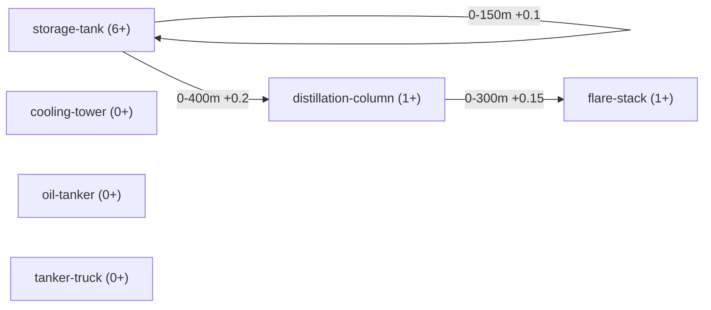

# From detections to meaning: a semantic graph

Status: roadmap/design draft, nothing here is implemented yet.

## The problem with a flat cluster

`README.md`'s existing "Composition rule" draft is a single flat step: cluster nearby detections
by proximity (DBSCAN `eps`), then match the cluster's component counts against one profile table
to decide "is this a refinery." That's the special case of a more general shape this doc is about:

- A component doesn't necessarily belong to exactly one higher-level thing. The same storage tank
  could be evidence for "this is part of an oil refinery" *or* "this is part of a separate tank
  farm/fuel depot" depending on what else is nearby — ownership isn't exclusive, so a tree
  ("parent/child") is the wrong shape. A graph is: a component has proximity *edges* to whatever's
  near it, and which higher-level grouping(s) it ends up counted toward falls out of scoring those
  edges against different site profiles, not a single fixed assignment.
- A site's boundary isn't drawn or configured — it emerges from where the proximity chain breaks.
  Worked example (the one raised in conversation): a storage tank near a chimney near a
  distillation column, all within the proximity threshold of each other, raises the probability
  this is an oil refinery. The site's extent is exactly the connected region reachable by chaining
  "next component within threshold" outward from any seed component in it — it stops, naturally,
  at the point where no further oil-refinery-relevant component is found within reach. This is
  ordinary density-reachable clustering (what DBSCAN already does); the site boundary is a
  byproduct of the algorithm, not a separate step.
- The same node-and-edge idea can stack. A site could itself become a node at a higher level (e.g.
  several sites close together reading as one industrial/port complex) — not designed yet, flagged
  so the base layer doesn't accidentally get built in a way that can't stack.

## Proposed terminology

"Semantic parent/group" was the placeholder name in conversation; better names, since "parent"
implies exclusive tree ownership this explicitly isn't:

| Term | Meaning |
|---|---|
| **Component** | A base-level detection (storage tank, chimney, distillation column, ...) — a node. |
| **Edge** | A proximity relationship between two components, with a distance threshold — exactly the primitive `geometry.py` already computes (see below). |
| **Site** | An emergent cluster of components connected (directly or transitively) within threshold — what the worked example above converges on. Not exclusive: a component can sit inside more than one candidate site if it's near enough to more than one plausible cluster. |
| **Site profile** | The composition rule for one site *type* (generalizes `README.md`'s existing per-class count-range table): which component types, in what count ranges, define "this site reads as an oil refinery" vs. some other type. |

## What already exists in this repo that's relevant

- **`geometry.py`** (`oil_refinery/app/server/`) already computes global-pixel-space distance
  between two detection centroids, plus a `meters_per_pixel` scale factor — the exact edge-weight
  primitive this needs. Not currently wired into anything; this is what would consume it.
- **`scripts/subclass_graph.py`** already does a *related but narrower* thing: proximity-based
  confidence boosting between a single class's own sub-classes (e.g. `fence-face` boosting a
  nearby `fence-top` detection's confidence), as directed edges with a min/max distance and a
  boost value, stored per-class in `classes/<parent>/subclass_graph.json`. Different purpose
  (adjusting confidence during labeling, not identifying a site) and different scope (siblings of
  one class, not cross-class site composition) — but the same core shape (typed nodes +
  distance-threshold edges). Worth knowing before building this so the two don't end up as two
  incompatible graph formats solving adjacent problems.
- **`README.md`'s Composition rule draft** is the single-level special case of a site graph:
  cluster once, match one profile. This doc generalizes it (multiple candidate sites per
  component, multiple levels) rather than replacing it — the flat version is still probably the
  right first implementation.

## Prerequisite: dedup

Before components can be clustered into sites at all, detections from multiple fused models (see
earlier roadmap discussion — xView model + a custom-trained model) need to be collapsed where they
describe the same real-world object. Same distance-math primitive as edges above, applied earlier:
match detections across models by centroid distance, merge matches into one component before the
site graph ever sees them.

## Two refinements settled in conversation

- **Bridging mitigation**: two distinct real facilities getting merged into one cluster by a
  single close component pair (a real risk in dense areas like ports/refinery complexes) is
  guarded against by requiring **type coverage, not just presence**: a site profile match needs a
  minimum number of the profile's *distinct* component types to be present (each within its own
  count range), not just a handful of components total. A bridged blob spanning two unrelated
  facilities is unlikely to coincidentally satisfy full type coverage for either profile, so a weak
  match (e.g. 2 of 6 expected types) should be treated as no identification rather than a
  low-confidence one. Doesn't eliminate the risk, but narrows it considerably — still worth testing
  against real adjacent-facility cases once there's real data.
  **Same-type adjacency (two real refineries merging into one detected site) is explicitly not
  treated as a separate problem** -- if it happens, that's the proximity threshold being too loose
  for that case, i.e. a calibration issue (see the placeholder-numbers caveat below), not a gap in
  the aggregation logic itself.
- **Per-component-class proximity, not one global threshold**: different component types within
  the same site profile can legitimately have different density characteristics (e.g. storage
  tanks tightly packed, a flare stack or crane much sparser but still genuinely part of the site).
  A single `eps` for the whole site profile can't represent that. `scripts/subclass_graph.py`
  already solves exactly this shape of problem for a different purpose — its edges are
  `{from, to, min_distance_m, max_distance_m, boost}`, i.e. per-*pair*-of-types distance ranges,
  not one graph-wide constant. A site profile's proximity rules should very likely reuse that same
  edge shape (component-type pairs -> distance range) rather than inventing a new schema.

## Proposed schema: a site profile is one graph

Consolidating the above: counts, per-pair proximity, and the identification threshold shouldn't be
three separate config surfaces (a table plus ad-hoc rules) — they're all properties of one graph,
in the same shape `subclass_graph.json` already uses, just one level up (component types instead
of sub-classes of one class) and with one new graph-level field:

```json
{
  "site_type": "oil_refinery",
  "identification_threshold": { "min_types_present": 4, "of_total_types": 6 },
  "nodes": {
    "storage-tank":         { "min_count": 6, "max_count": null },
    "flare-stack":          { "min_count": 1, "max_count": null },
    "distillation-column":  { "min_count": 1, "max_count": null },
    "cooling-tower":        { "min_count": 0, "max_count": null },
    "oil-tanker":           { "min_count": 0, "max_count": null },
    "tanker-truck":         { "min_count": 0, "max_count": null }
  },
  "edges": [
    { "from": "storage-tank", "to": "storage-tank", "min_distance_m": 0, "max_distance_m": 150, "boost": 0.1 },
    { "from": "storage-tank", "to": "distillation-column", "min_distance_m": 0, "max_distance_m": 400, "boost": 0.2 },
    { "from": "distillation-column", "to": "flare-stack", "min_distance_m": 0, "max_distance_m": 300, "boost": 0.15 }
  ]
}
```

Same graph, illustrated the way `/manual`'s graph tab already renders `subclass_graph.json` today
(Mermaid, nodes as boxes, edges labeled with their distance range + boost):



`cooling-tower`, `oil-tanker`, and `tanker-truck` sit in the graph as valid profile members with no
edge yet in this sketch -- corroborating, per `README.md`'s original table, not proximity-defining.
The `storage-tank -> storage-tank` edge is a same-type self-loop: tanks clustering near *other*
tanks is itself a real proximity signal for this profile, not just tanks near a distillation column.

- `nodes`: one entry per component type this profile cares about, with its expected count range
  (`README.md`'s existing per-class table, just moved into the graph instead of sitting beside it).
- `edges`: per-type-pair proximity (`min/max_distance_m`) and a confidence weight (`boost`) --
  identical shape to `subclass_graph.json`'s edges today, same field names on purpose.
- `identification_threshold`: the graph-level type-coverage rule from the bridging mitigation above
  -- e.g. "at least 4 of these 6 node types must be present, each within its own count range" for
  this graph to signal "oil refinery" at all.

Sketch only -- every number above is a placeholder, same caveat `README.md` already carries for its
own table. The point of this section is the *shape* (one graph, not three separate config surfaces),
not these specific values.

Because it's the same shape as `subclass_graph.json`, the existing `/manual` graph tab's Mermaid
rendering (nodes as boxes, edges labeled with their distance range) should extend to this with
comparatively little new code -- the "easier for a human to understand the relation" benefit isn't
speculative, it's already-built tooling this would inherit.

## Resolved: candidacy vs. affiliation

"A component isn't exclusively owned by one site" (stated early in this doc) describes the raw
graph, not the final output -- those are two different things, worth keeping distinct:

- **Candidacy** (the graph): non-exclusive by construction. A component can have proximity edges
  reaching more than one plausible cluster, so it's *evaluated* against more than one site profile.
- **Affiliation** (the aggregator's output): exclusive. The aggregator resolves candidacy by
  ranking candidate sites by prominence (how strongly each satisfies its profile), lets the most
  prominent one claim its region and every component in it first, then removes those claimed
  components before evaluating the next candidate. A component already affiliated with site X
  cannot also be claimed by a nearby site Y, even if it was geometrically a candidate for both.

So membership is non-exclusive going in (candidacy), exclusive coming out (affiliation) -- a greedy
claim-by-prominence resolution, not weighted/fuzzy multi-membership.

## Resolved: prominence scoring

Two-tier, evaluated in order -- not one blended number:

1. **Type-coverage ratio** (primary key): distinct node types present within their count range,
   divided by total node types in the profile -- the same ratio `identification_threshold` already
   uses. Decides ranking whenever candidates differ on it.
2. **Instance strength** (tie-break only, when two candidates have equal type-coverage ratio):
   total component *instances*, not just which types were found -- a site with 12 storage tanks is
   a stronger candidate than one with 6, even though both clear the "storage-tank present" bar.
   Raw instance counts aren't comparable across different site profiles, though -- a profile with
   larger expected counts would win on raw numbers regardless of fit. Normalize each matched type's
   instance count against *that type's own* `min_count` before summing: `sum(actual_count /
   min_count)` across matched types. A profile matched at exactly its minimums scores 1 per type
   either way; a profile matched several multiples over its minimums scores higher -- comparable
   across profiles with different expected magnitudes, per the point about each parent having
   different components.

Type-coverage decides first; instance strength only breaks a tie, matching "if both have the same
score, multiply by the number of instances" from conversation directly.

## Open questions (still unresolved)

- Whether two-tier (coverage, then instance-strength tie-break) is the right shape once tested
  against real data, vs. some blended weighting -- untested, just specified.
- What happens on a genuine tie even after the instance-strength tie-break (both ratio and
  normalized instance strength equal) -- not specified; likely rare enough to defer.
- Whether a level above "site" (e.g. multi-site industrial complex) is actually needed for this
  project, or a speculative extension not worth building until a real case calls for it.
- All distance thresholds, count ranges, and type-coverage minimums remain placeholders per
  `README.md` — need calibration against real, known refineries before any of this is trustworthy,
  not just structurally sound. **This is an accepted, deliberate risk of the chosen approach, not
  a gap to patch by pulling in outside data sources** -- the point of this phase is to see what's
  achievable with exactly these two models (xView + the custom-trained one), not to fuse in
  additional external data to compensate. Calibration still means testing against known real
  refineries as ground truth (as already planned) -- that's validating the two models' own output
  against reality, not adding a third data source.

## Sequencing

Depends on work not yet done: the xView checkpoint reaching a usable state, a custom-trained model
for the additional classes, and dedup across both. Not something to start building yet — this file
exists to hold the shape of the idea, not to schedule it.
